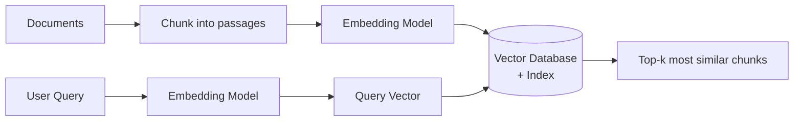
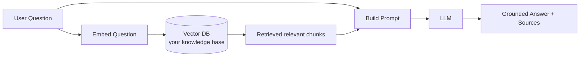

# Vector Databases & RAG — A Complete Guide

> A from-scratch explanation of what vector databases are, how they work internally, and how to build a Retrieval-Augmented Generation (RAG) system to solve a real-world problem.

---

## Table of Contents

1. [The Problem: Why Regular Databases Aren't Enough](#1-the-problem-why-regular-databases-arent-enough)
2. [Core Concept: Embeddings & Vectors](#2-core-concept-embeddings--vectors)
3. [What Is a Vector Database?](#3-what-is-a-vector-database)
4. [How a Vector Database Works (Internals)](#4-how-a-vector-database-works-internals)
   - [Distance & Similarity Metrics](#41-distance--similarity-metrics)
   - [The Indexing Problem (ANN)](#42-the-indexing-problem-approximate-nearest-neighbor)
   - [Common Index Types: HNSW, IVF, PQ](#43-common-index-types)
5. [Vector DB vs Traditional DB](#5-vector-db-vs-traditional-db)
6. [Popular Vector Databases](#6-popular-vector-databases)
7. [What Is RAG (Retrieval-Augmented Generation)?](#7-what-is-rag-retrieval-augmented-generation)
8. [Real-World Example: A Medicine Information Assistant](#8-real-world-example-a-medicine-information-assistant)
   - [Full Working Code](#84-full-working-code)
9. [Best Practices & Gotchas](#9-best-practices--gotchas)
10. [Summary](#10-summary)

---

## 1. The Problem: Why Regular Databases Aren't Enough

Traditional databases (SQL, MongoDB, etc.) are excellent at **exact and structured matching**:

```sql
SELECT * FROM medicines WHERE name = 'Napa' AND strength = '500mg';
```

But they fall apart when the query is about **meaning** rather than exact keywords. Consider these three questions:

- "Is it safe to take a fever medicine while pregnant?"
- "Can expecting mothers use paracetamol?"
- "pregnancy painkiller safety"

To a human, these are almost the same question. To a keyword database, they share almost no words. A `LIKE '%fever%'` query would completely miss the document that says *"Paracetamol is the preferred analgesic during gestation."*

The core problem: **we need to search by semantic meaning, not by exact text.** That is exactly what vector databases are built for.

---

## 2. Core Concept: Embeddings & Vectors

### What is an embedding?

An **embedding** is a list of numbers (a *vector*) that represents the *meaning* of a piece of data — text, an image, audio, anything. A machine-learning model (an "embedding model") reads your text and outputs, say, 384 or 1536 floating-point numbers.

```
"Paracetamol reduces fever"  ──▶  [ 0.021, -0.88, 0.13, ... , 0.44 ]   (e.g. 384 numbers)
```

The magic property: **things with similar meaning get similar vectors.** Their points land close together in space; unrelated things land far apart.

### A visual intuition

Imagine reducing every concept to just 2 numbers so we can plot them on a graph:

```
        medicine / health axis  ▲
                                │   • "paracetamol for fever"
                                │  • "ibuprofen for pain"
                                │
                                │
        ────────────────────────┼────────────────────────▶  delivery / logistics axis
                                │
                                │                • "1-hour medicine delivery"
                                │              • "track my order"
                                │
```

Real embeddings do this in hundreds of dimensions instead of 2, capturing far more nuance — but the idea is identical: **meaning becomes geometry.** Searching for related meaning becomes "find the nearest points."

### Why "vectors"?

A list of numbers like `[0.021, -0.88, 0.13]` *is* a vector — a coordinate in high-dimensional space. If two vectors point in nearly the same direction, the two pieces of text mean nearly the same thing.

---

## 3. What Is a Vector Database?

A **vector database** is a database purpose-built to **store millions/billions of embeddings and find the most similar ones to a query embedding — fast.**

Its job boils down to one operation, done extremely efficiently:

> Given a query vector, return the *k* stored vectors that are closest to it (k-Nearest Neighbors).

It also handles everything a real system needs around that: metadata storage, filtering (`WHERE category = 'antibiotic'`), inserts/updates/deletes, persistence, and scaling.

**In one sentence:** A vector database is to *meaning-based search* what a SQL database is to *exact structured search*.

---

## 4. How a Vector Database Works (Internals)

The full lifecycle has two phases.

### Phase A — Ingestion (done once, ahead of time)

```
Raw data ──▶ Chunking ──▶ Embedding model ──▶ Vectors ──▶ Index them in the vector DB
```

1. **Chunk** large documents into smaller passages (e.g. 200–500 words).
2. **Embed** each chunk into a vector using an embedding model.
3. **Store** each vector alongside its original text and metadata, and add it to a search **index**.

### Phase B — Query (done on every search)

```
User query ──▶ Embedding model ──▶ Query vector ──▶ Vector DB search ──▶ Top-k similar chunks
```

The same embedding model turns the user's question into a vector, and the database returns the nearest stored vectors.



### 4.1 Distance & Similarity Metrics

"Closest" needs a precise definition. The three common metrics:

| Metric | What it measures | Range | Use when |
|---|---|---|---|
| **Cosine similarity** | Angle between vectors (direction, ignores length) | -1 to 1 (higher = more similar) | Text embeddings (most common) |
| **Dot product** | Direction *and* magnitude combined | -∞ to ∞ | When magnitude carries meaning |
| **Euclidean (L2)** | Straight-line distance between points | 0 to ∞ (lower = more similar) | Image / spatial data |

**Cosine similarity** is the default for text. Formula:

```
cosine(A, B) = (A · B) / (‖A‖ × ‖B‖)
```

It asks: *do these two vectors point in the same direction?* Two documents about the same topic point the same way regardless of length.

### 4.2 The Indexing Problem (Approximate Nearest Neighbor)

Here's the catch. To find the true nearest neighbor, you could compare the query against **every** stored vector (a "brute-force" or "flat" search). For a few thousand items that's fine. For 100 million items it's hopelessly slow — that's 100M distance calculations *per query*.

The solution: **Approximate Nearest Neighbor (ANN)** algorithms. They trade a tiny amount of accuracy (you might miss the #1 result occasionally and get #2) for **enormous speed gains** (100–1000×). This trade-off is almost always worth it and is what makes vector DBs practical at scale.

### 4.3 Common Index Types

**HNSW (Hierarchical Navigable Small World)** — the most popular.
Think of it as a multi-layer highway network of vectors. Top layers have long "express" connections for jumping across the space quickly; lower layers have dense local connections for fine-grained search. A query starts at the top, greedily hops toward closer nodes, and descends layer by layer. Very fast queries, high recall — at the cost of higher memory use.

**IVF (Inverted File Index)** — cluster-based.
The vector space is partitioned into clusters (like Voronoi cells) using k-means. At query time, you only search the few nearest clusters instead of the whole dataset. Memory-efficient; you tune how many clusters to probe (`nprobe`) to trade speed vs accuracy.

**PQ (Product Quantization)** — compression.
Compresses vectors into compact codes so billions fit in RAM, at some accuracy cost. Often combined with IVF (`IVFPQ`).

```
Flat (brute force):  slowest, 100% accurate,  best for < ~10k vectors
HNSW:                very fast, high recall,   great default, higher RAM
IVF / IVFPQ:         fast, tunable, memory-efficient, best at massive scale
```

---

## 5. Vector DB vs Traditional DB

| Aspect | Traditional DB (SQL) | Vector DB |
|---|---|---|
| Query type | Exact / range match | Semantic similarity |
| "Find" means | Rows matching conditions | Nearest vectors in space |
| Example query | `WHERE age > 30` | "documents *like* this one" |
| Core data | Rows & columns | High-dimensional vectors + metadata |
| Key algorithm | B-tree index | ANN index (HNSW, IVF...) |
| Handles typos/synonyms | No | Yes (meaning-based) |

They are **complementary**, not competitors. Modern systems often use both — or a hybrid search that combines keyword (BM25) and vector search.

---

## 6. Popular Vector Databases

| Tool | Type | Notes |
|---|---|---|
| **Chroma** | Open-source, embedded | Easiest to start; great for prototypes & local dev |
| **FAISS** | Library (Meta) | Blazing fast, in-process; a library, not a full DB |
| **Pinecone** | Managed cloud | Fully hosted, scales easily, no ops |
| **Qdrant** | Open-source + cloud | Rust-based, strong filtering, production-ready |
| **Weaviate** | Open-source + cloud | Built-in vectorization modules, hybrid search |
| **Milvus** | Open-source | Built for billion-scale workloads |
| **pgvector** | Postgres extension | Add vectors to an existing Postgres DB — often the simplest choice if you already run Postgres |

---

## 7. What Is RAG (Retrieval-Augmented Generation)?

Large Language Models (LLMs) like GPT or Claude are powerful but have two problems:

1. **They don't know your private/current data** (your product catalog, your drug database, yesterday's docs).
2. **They hallucinate** — confidently inventing answers when they don't know.

**RAG (Retrieval-Augmented Generation)** fixes both. Instead of asking the LLM to answer from memory, you:

1. **Retrieve** the relevant facts from your own data (using a vector database), then
2. **Augment** the prompt by injecting those facts, then
3. **Generate** an answer grounded in those retrieved facts.



The result: the LLM answers using **your** trusted data, can **cite sources**, stays **up to date** (just update the DB — no retraining), and hallucinates far less. **The vector database is the "retrieval" engine at the heart of RAG.**

---

## 8. Real-World Example: A Medicine Information Assistant

### 8.1 The Problem

A digital pharmacy gets thousands of repetitive patient questions:

- *"Can I take Napa during pregnancy?"*
- *"What is the max daily dose of paracetamol?"*
- *"Which painkiller is safe if I have asthma?"*

Support agents answer the same questions endlessly, and a plain chatbot would be dangerous — it might **hallucinate a wrong dose**, which is a safety risk. We need answers that come **only from a verified drug-information database**, with sources.

**RAG is the perfect fit:** retrieve verified drug facts, then let the LLM phrase a safe, grounded answer.

### 8.2 The Architecture

```
Verified drug monographs (your data)
        │  (one-time ingestion)
        ▼
   chunk → embed → store in Chroma
        │
        ▼
Patient question ──embed──▶ Chroma finds top-3 relevant facts ──▶ LLM writes a grounded answer with sources
```

### 8.3 How It Solves the Problem

- **No hallucinated doses** — the model is instructed to answer *only* from retrieved verified text.
- **Always current** — update a monograph in the DB, and answers update instantly. No model retraining.
- **Traceable** — every answer can cite which document it came from.
- **Understands intent** — "expecting mother" matches "pregnancy" because of semantic search.

### 8.4 Full Working Code

Install dependencies:

```bash
pip install chromadb sentence-transformers anthropic
```

```python
"""
Medicine Information Assistant — a minimal RAG system.

Pipeline:
  1. Ingest verified drug facts into a Chroma vector database.
  2. On a question, retrieve the most relevant facts (semantic search).
  3. Ask an LLM to answer ONLY from those facts, with sources.
"""

import chromadb
from chromadb.utils import embedding_functions
import anthropic

# ---------------------------------------------------------------------------
# STEP 0 — Your verified knowledge base.
# In production these come from your real drug database (e.g. MedEx / your CMS).
# Each entry is a small, self-contained, factual chunk.
# ---------------------------------------------------------------------------
DRUG_FACTS = [
    {
        "id": "napa-preg",
        "text": "Napa (Paracetamol) is considered the analgesic and antipyretic "
                "of choice during pregnancy. It is safe at normal therapeutic doses "
                "in all trimesters when used as directed.",
        "source": "Paracetamol Monograph — Pregnancy",
    },
    {
        "id": "para-maxdose",
        "text": "The maximum daily dose of Paracetamol for adults is 4000 mg "
                "(4 grams) in 24 hours. Exceeding this can cause serious liver damage.",
        "source": "Paracetamol Monograph — Dosage",
    },
    {
        "id": "ibuprofen-preg",
        "text": "Ibuprofen should be avoided during the third trimester of pregnancy "
                "as it may harm the fetus and affect labour. Paracetamol is preferred.",
        "source": "Ibuprofen Monograph — Pregnancy",
    },
    {
        "id": "ibuprofen-asthma",
        "text": "NSAIDs such as Ibuprofen can trigger bronchospasm in some asthmatic "
                "patients and should be used with caution in asthma. Paracetamol is "
                "generally a safer alternative for pain relief in asthmatics.",
        "source": "Ibuprofen Monograph — Precautions",
    },
    {
        "id": "para-mechanism",
        "text": "Paracetamol relieves pain and reduces fever. Unlike NSAIDs it has "
                "minimal anti-inflammatory effect and does not irritate the stomach lining.",
        "source": "Paracetamol Monograph — Pharmacology",
    },
]

# ---------------------------------------------------------------------------
# STEP 1 — Build the vector database (ingestion, done once).
# ---------------------------------------------------------------------------
# A local, in-memory Chroma client. Use PersistentClient(path=...) to save to disk.
client = chromadb.Client()

# The embedding model that converts text -> vectors.
# 'all-MiniLM-L6-v2' outputs 384-dim vectors; small, fast, runs locally & free.
embed_fn = embedding_functions.SentenceTransformerEmbeddingFunction(
    model_name="all-MiniLM-L6-v2"
)

collection = client.create_collection(
    name="drug_facts",
    embedding_function=embed_fn,
    metadata={"hnsw:space": "cosine"},  # use cosine similarity
)

# Chroma embeds every document automatically on add().
collection.add(
    ids=[d["id"] for d in DRUG_FACTS],
    documents=[d["text"] for d in DRUG_FACTS],
    metadatas=[{"source": d["source"]} for d in DRUG_FACTS],
)


# ---------------------------------------------------------------------------
# STEP 2 — Retrieval: find the most relevant facts for a question.
# ---------------------------------------------------------------------------
def retrieve(question: str, k: int = 3):
    """Return the top-k most semantically similar drug facts."""
    results = collection.query(query_texts=[question], n_results=k)
    chunks = []
    for text, meta, dist in zip(
        results["documents"][0],
        results["metadatas"][0],
        results["distances"][0],
    ):
        chunks.append({"text": text, "source": meta["source"], "distance": dist})
    return chunks


# ---------------------------------------------------------------------------
# STEP 3 — Generation: ask the LLM to answer ONLY from retrieved facts.
# ---------------------------------------------------------------------------
def answer(question: str) -> str:
    chunks = retrieve(question, k=3)

    # Build the context block from retrieved facts.
    context = "\n\n".join(
        f"[Source: {c['source']}]\n{c['text']}" for c in chunks
    )

    # The system prompt is the safety guardrail: no outside knowledge, no guessing.
    system_prompt = (
        "You are a careful medicine-information assistant. Answer the user's "
        "question using ONLY the verified facts provided below. If the facts do "
        "not contain the answer, say you don't have that information and advise "
        "consulting a pharmacist or doctor. Never invent doses or safety claims. "
        "Cite the source name(s) you used.\n\n"
        f"VERIFIED FACTS:\n{context}"
    )

    llm = anthropic.Anthropic()  # reads ANTHROPIC_API_KEY from environment
    resp = llm.messages.create(
        model="claude-sonnet-4-6",
        max_tokens=400,
        system=system_prompt,
        messages=[{"role": "user", "content": question}],
    )
    return resp.content[0].text


# ---------------------------------------------------------------------------
# DEMO
# ---------------------------------------------------------------------------
if __name__ == "__main__":
    question = "Can I take Napa during pregnancy, and what's the max daily dose?"

    print("QUESTION:", question, "\n")

    print("--- Retrieved facts (what the DB found) ---")
    for c in retrieve(question):
        print(f"  • ({c['distance']:.3f}) {c['source']}")
    print()

    print("--- Grounded answer ---")
    print(answer(question))
```

### 8.5 What Happens When You Run It

For the question *"Can I take Napa during pregnancy, and what's the max daily dose?"*, the vector search retrieves the **pregnancy** fact and the **max-dose** fact (even though the question never says "paracetamol" or "4000 mg") because their *meaning* is closest. The LLM then produces something like:

> Yes — Napa (Paracetamol) is considered the pain reliever of choice during pregnancy and is safe at normal doses across all trimesters. The maximum daily dose for adults is **4000 mg (4 g) in 24 hours**; exceeding this can cause serious liver damage.
> *Sources: Paracetamol Monograph — Pregnancy; Paracetamol Monograph — Dosage.*

Notice: the answer is **grounded, sourced, and safe** — it comes straight from your verified data, not the model's imagination.

### 8.6 Understanding "Distance" in the Output

Chroma returns a **distance** (lower = more similar for cosine). You can use it as a **confidence threshold**: if the closest chunk's distance is above some cutoff, the question is probably out-of-scope (e.g. "what's the weather?") and you should respond "I can only help with medicine information" instead of forcing a bad answer. This is a key safety pattern in production RAG.

---

## 9. Best Practices & Gotchas

**Chunking matters most.** Too large → vectors are unfocused and retrieval is noisy. Too small → context gets fragmented. Start around 200–500 tokens with a slight overlap (~10–15%) between chunks so ideas that span a boundary aren't lost.

**Use the same embedding model for ingestion and querying.** Vectors from different models live in incompatible spaces — mixing them silently breaks search.

**Add metadata and filter with it.** Store fields like `category`, `language`, or `drug_class` and combine keyword filters with vector search (e.g. only search antibiotics). This "pre-filtering" boosts both speed and relevance.

**Consider hybrid search.** Pure vector search can miss exact matches like specific product codes or brand names. Combining keyword (BM25) + vector search often beats either alone.

**Set a relevance threshold.** Always have a fallback for "nothing relevant found" so the LLM doesn't answer from thin air.

**Re-ranking improves quality.** For high-stakes use, retrieve the top ~20 with the vector DB, then use a cross-encoder re-ranker to pick the best 3–5 before sending to the LLM.

**Keep the knowledge base fresh.** The biggest advantage of RAG is that updating data needs no model retraining — build a pipeline to re-embed changed documents.

**Mind the dimensions & cost.** Higher-dimensional embeddings can be more accurate but cost more RAM and compute. Pick a model sized to your needs (384-dim is plenty for many tasks).

---

## 10. Summary

- An **embedding** turns data into a vector that captures *meaning*; similar meanings → nearby vectors.
- A **vector database** stores these vectors and finds the nearest ones to a query, fast, using **ANN indexes** (HNSW, IVF, PQ) and **similarity metrics** (usually cosine).
- It enables **semantic search** — finding things by meaning, not keywords — which traditional databases can't do.
- **RAG** uses a vector database to retrieve relevant facts from *your* data and feed them to an LLM, producing answers that are **grounded, current, sourced, and far less prone to hallucination.**
- The **medicine assistant** example shows the whole loop: ingest verified facts → retrieve by meaning → generate a safe, cited answer — turning a risky chatbot into a trustworthy one.

Once this clicks, the mental model is simple:

> **Vector DB = search by meaning. RAG = let an LLM answer using what that search finds.**

---

*Happy building.* 🚀
