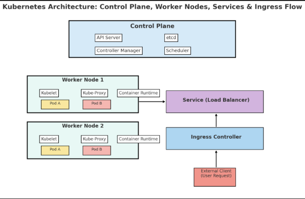
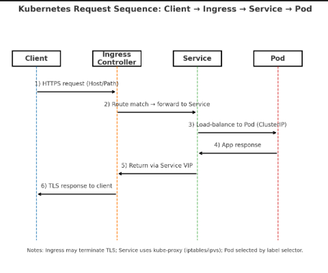

Here’s a full technical documentation on **Kubernetes**, structured like professional technical documentation with explanations, flows, and examples.

# 📘 Kubernetes Technical Documentation

## 1\. Introduction to Kubernetes

**Kubernetes (K8s)** is an **open-source container orchestration platform** developed by Google and now maintained by the **Cloud Native Computing Foundation (CNCF)**.  
It automates deployment, scaling, and management of containerized applications.

### Key Problems Kubernetes Solves

- Scaling applications automatically (up or down).
- Self-healing (restart failed containers, reschedule on healthy nodes).
- Load balancing across multiple instances.
- Efficient resource utilization.
- Declarative configuration (Infrastructure as Code).

## 2\. Core Concepts and Architecture

### 2.1 Kubernetes Architecture

Kubernetes follows a **master-worker architecture**:

#### Control Plane (Master Components)

- **API Server**: Entry point for all commands (kubectl/REST API).
- **etcd**: Key-value store for cluster state and configuration.
- **Controller Manager**: Ensures desired state (e.g., scaling replicas).
- **Scheduler**: Assigns Pods to worker nodes based on resources and constraints.

#### Worker Node Components

- **Kubelet**: Agent that communicates with API server, ensures Pods run.
- **Kube-Proxy**: Manages networking and load balancing.
- **Container Runtime**: Runs containers (Docker, containerd, CRI-O).

### 2.2 Kubernetes Objects

- **Pod**: Smallest deployable unit. Wraps one or more containers.
- **Service**: Provides stable networking and load balancing for Pods.
- **Deployment**: Manages stateless applications (rolling updates, scaling).
- **ReplicaSet**: Ensures a specified number of pod replicas are running.
- **StatefulSet**: Manages stateful applications (databases).
- **ConfigMap**: Stores non-confidential configuration data.
- **Secret**: Stores sensitive data (passwords, API keys).
- **Ingress**: Manages HTTP/HTTPS traffic to services.

## 3\. Kubernetes Workflow (High-Level Flow)

1. Developer writes a **Deployment YAML** describing desired state.
2. YAML is applied via kubectl apply -f deployment.yaml.
3. **API Server** validates request, stores state in **etcd**.
4. **Scheduler** assigns Pods to Nodes based on resources.
5. **Kubelet** runs containers using the runtime (e.g., Docker).
6. **Kube-Proxy** sets up networking to expose Pods via Services.
7. **Controller Manager** continuously monitors state and reconciles drift.

## 4\. Example Kubernetes Resources

### 4.1 Pod Example

```yaml
apiVersion: v1
kind: Pod
metadata:
  name: nginx-pod
spec:
  containers:
    - name: nginx
      image: nginx:latest
      ports:
        - containerPort: 80

```

👉 Runs a single **Nginx container** in a Pod.

### 4.2 Deployment Example

```yaml
apiVersion: apps/v1
kind: Deployment
metadata:
  name: nginx-deployment
spec:
  replicas: 3
  selector:
    matchLabels:
      app: nginx
  template:
    metadata:
      labels:
        app: nginx
    spec:
      containers:
        - name: nginx
          image: nginx:1.19
          ports:
            - containerPort: 80

```

👉 Ensures **3 replicas** of the Nginx Pod are always running.

### 4.3 Service Example

```yaml
apiVersion: v1
kind: Service
metadata:
  name: nginx-service
spec:
  selector:
    app: nginx
  ports:
    - protocol: TCP
      port: 80
      targetPort: 80
  type: LoadBalancer

```

👉 Exposes Nginx Pods to external traffic using a LoadBalancer.

### 4.4 Ingress Example

```yaml
apiVersion: networking.k8s.io/v1
kind: Ingress
metadata:
  name: nginx-ingress
spec:
  rules:
    - host: example.com
      http:
        paths:
          - path: /
            pathType: Prefix
            backend:
              service:
                name: nginx-service
                port:
                  number: 80

```

👉 Routes HTTP requests from example.com to the Nginx Service.

## 5\. Kubernetes Networking Flow

1. **Pod-to-Pod Communication**
    - Every Pod gets a unique IP within the cluster.
    - Pods can talk to each other directly via IP.
2. **Service for Load Balancing**
    - Provides a stable **ClusterIP**.
    - Handles traffic distribution across Pods.
3. **Ingress for External Traffic**
    - Routes HTTP(S) traffic from outside into Services.

## 6\. Scaling and Self-Healing

- **Horizontal Pod Autoscaler (HPA)**:  
    Scales Pods based on CPU/memory metrics.
- ```bash kubectl autoscale deployment nginx-deployment --cpu-percent=50 --min=2 --max=10 ```
- **Self-Healing**:  
    If a Pod crashes, Kubernetes automatically reschedules it on a healthy Node.

## 7\. Example Flow: Deploying a Web App

1. Create a **Deployment** for a web app (say, React + Django backend).
2. Expose it using a **Service**.
3. Configure **Ingress** to allow external access via domain.
4. Apply **ConfigMaps** and **Secrets** for environment variables.
5. Use **HPA** to auto-scale based on traffic.

## 8\. Kubernetes in Real-World Scenarios

- **Microservices Architecture**:  
    Deploy multiple microservices with independent scaling.
- **DevOps CI/CD Pipelines**:  
    Automate deployments with Helm + GitOps (ArgoCD, Flux).
- **Big Data / AI Workloads**:  
    Run TensorFlow, PyTorch training jobs on Kubernetes clusters.
- **Multi-cloud / Hybrid Cloud**:  
    Deploy apps across AWS, GCP, and Azure using the same K8s manifests.

## 9\. Best Practices

- Use **Namespaces** to isolate environments (dev, staging, prod).
- Store configs in **ConfigMaps** and secrets in **Secrets**.
- Implement **Resource Limits** (CPU/Memory) for each container.
- Use **Liveness and Readiness Probes** for health checks.
- Apply **RBAC (Role-Based Access Control)** for security.
- Use **Helm Charts** for packaging applications.

## 10\. Tools in Kubernetes Ecosystem

- **Helm** → Package manager for Kubernetes.
- **Kustomize** → Manage Kubernetes YAML configurations.
- **Prometheus & Grafana** → Monitoring & visualization.
- **Istio / Linkerd** → Service mesh for traffic routing & observability.
- **Kubeflow** → ML workflows on Kubernetes.

## 11\. Summary

Kubernetes provides:

- **Scalability**: Handle millions of requests with auto-scaling.
- **Resilience**: Self-healing and fault-tolerance.
- **Portability**: Run on any cloud or on-prem infrastructure.
- **Flexibility**: Works with multiple container runtimes.

It has become the **de facto standard** for running containerized workloads in modern cloud-native applications.

    
Here’s the visual architecture diagram for Kubernetes showing the control plane, worker nodes, pods, services, and ingress flow.
This diagram illustrates how:
- The control plane manages the cluster.
- Worker nodes run Pods.
- Services provide stable access and load balancing.
- Ingress routes external client requests into the cluster.

   

understanding the **YAML keys** for Kubernetes manifests is the best way to deeply master Kubernetes configuration. Let’s go step by step.

I’ll explain the **common keys** (applicable across all objects), then break down **resource-specific keys** for **Deployment, Service, StatefulSet, and Ingress**, with examples.

# 📘 Kubernetes YAML Keys Explained

## 1\. Common YAML Keys (used in all Kubernetes objects)

Every Kubernetes manifest follows this basic structure:

```yaml
apiVersion: <API group/version>
kind: <Resource type>
metadata:
  name: <resource-name>
  namespace: <namespace-name>
  labels:
    <key>: <value>
  annotations:
    <key>: <value>
spec:
  # Resource-specific configuration here

```

### 🔑 Key Explanations

- **apiVersion**
  - Defines the API group and version.
  - Example:
    - v1 (Pods, Services, ConfigMaps)
    - apps/v1 (Deployments, StatefulSets, DaemonSets)
    - networking.k8s.io/v1 (Ingress, NetworkPolicy)
- **kind**
  - Type of resource (e.g., Pod, Deployment, Service, Ingress).
- **metadata**
  - Describes the resource (name, namespace, labels).
  - name: Unique name of the resource.
  - namespace: Logical grouping (e.g., default, prod).
  - labels: Key/value tags used for selection.
  - annotations: Extra metadata (e.g., ingress configs, monitoring).
- **spec**
  - Defines the **desired state** of the resource.
  - Changes depending on the resource type.
- **status** (usually added by Kubernetes, not user)
  - Shows current state (e.g., running, pending, available replicas).

## 2\. Deployment YAML Keys

A **Deployment** ensures a certain number of **Pods** are running.

```yaml
apiVersion: apps/v1
kind: Deployment
metadata:
  name: my-app
spec:
  replicas: 3
  selector:
    matchLabels:
      app: my-app
  template:
    metadata:
      labels:
        app: my-app
    spec:
      containers:
        - name: my-container
          image: nginx:1.19
          ports:
            - containerPort: 80
          resources:
            requests:
              cpu: "100m"
              memory: "200Mi"
            limits:
              cpu: "500m"
              memory: "500Mi"
          env:
            - name: ENVIRONMENT
              value: "production"
          volumeMounts:
            - name: app-storage
              mountPath: /data
      volumes:
        - name: app-storage
          emptyDir: {}

```

### 🔑 Deployment-specific keys

- replicas: Number of Pod copies.
- selector: Defines which Pods are managed by this Deployment (must match template.metadata.labels).
- template: Pod specification.
  - containers: List of containers inside the Pod.
    - name: Container name.
    - image: Docker image.
    - ports: Exposed ports (containerPort).
    - resources: CPU/memory requests (minimum) and limits (maximum).
    - env: Environment variables.
    - volumeMounts: Mount a volume into container.
  - volumes: Storage volumes (emptyDir, configMap, secret, persistentVolumeClaim, etc.).

## 3\. Service YAML Keys

A **Service** exposes a set of Pods under a stable IP/DNS.

```yaml
apiVersion: v1
kind: Service
metadata:
  name: my-service
spec:
  selector:
    app: my-app
  ports:
    - protocol: TCP
      port: 80
      targetPort: 80
      nodePort: 30080
  type: LoadBalancer

```

### 🔑 Service-specific keys

- selector: Match labels to target Pods.
- ports:
  - protocol: TCP/UDP.
  - port: Port exposed by Service.
  - targetPort: Port inside the Pod’s container.
  - nodePort: Exposes port on each node (only if type: NodePort).
- type:
  - ClusterIP (default, internal only).
  - NodePort (accessible via Node’s IP + port).
  - LoadBalancer (provision external LB).
  - ExternalName (maps to external DNS).

## 4\. Ingress YAML Keys

Ingress routes external HTTP(S) traffic into Services.

```yaml
apiVersion: networking.k8s.io/v1
kind: Ingress
metadata:
  name: my-ingress
  annotations:
    nginx.ingress.kubernetes.io/rewrite-target: /
spec:
  rules:
    - host: myapp.example.com
      http:
        paths:
          - path: /
            pathType: Prefix
            backend:
              service:
                name: my-service
                port:
                  number: 80
  tls:
    - hosts:
        - myapp.example.com
      secretName: my-tls-secret

```

### 🔑 Ingress-specific keys

- rules: Defines routing.
  - host: Domain name.
  - http.paths: Path-based routing.
    - path: URL path.
    - pathType: Prefix (match prefix) or Exact.
    - backend.service.name: Target Service.
    - backend.service.port.number: Port on Service.
- tls: TLS/SSL configuration.
  - hosts: Domains secured.
  - secretName: Secret containing TLS cert and key.
- annotations: Extra settings (e.g., nginx ingress features, rewrite).

## 5\. StatefulSet YAML Keys

StatefulSet manages **stateful applications** (databases, Kafka, etc.).

```yaml
apiVersion: apps/v1
kind: StatefulSet
metadata:
  name: my-db
spec:
  serviceName: "db-service"
  replicas: 3
  selector:
    matchLabels:
      app: db
  template:
    metadata:
      labels:
        app: db
    spec:
      containers:
        - name: db-container
          image: mysql:5.7
          ports:
            - containerPort: 3306
          volumeMounts:
            - name: db-storage
              mountPath: /var/lib/mysql
  volumeClaimTemplates:
    - metadata:
        name: db-storage
      spec:
        accessModes: ["ReadWriteOnce"]
        resources:
          requests:
            storage: 10Gi

```

### 🔑 StatefulSet-specific keys

- serviceName: Headless Service used for stable network IDs.
- replicas: Number of Pods.
- selector: Label matching.
- template: Pod definition (like Deployment).
- volumeClaimTemplates: Defines PersistentVolumeClaims (PVCs). Each replica gets its own volume.

## 6\. Other Useful Keys Across Resources

- **strategy** (in Deployments):
  - type: RollingUpdate or Recreate.
  - Rolling updates: Gradual replace Pods.
- **updateStrategy** (in StatefulSet/DaemonSet):
  - Controls how Pods are updated.
- **affinity & nodeSelector**:
  - Control Pod scheduling.
- **tolerations**:
  - Allow Pods to run on tainted nodes.
- **securityContext**:
  - User permissions, file access, runAsUser.
- **livenessProbe & readinessProbe**:
  - Health checks for restarting / routing traffic.
- **priorityClassName**:
  - Scheduling priority.

# ✅ Summary

- **Top-level keys**: apiVersion, kind, metadata, spec.
- **Deployment**: replicas, selector, template, containers, volumes.
- **Service**: selector, ports, type.
- **Ingress**: rules, tls, annotations.
- **StatefulSet**: serviceName, volumeClaimTemplates.
- **Advanced keys**: Probes, affinity, tolerations, resources, strategy.

let’s make a **Kubernetes YAML Cheat Sheet** in **table format**, compact enough to serve as a quick reference while writing manifests.

# 📘 Kubernetes YAML Cheat Sheet (Quick Reference)

## 1\. Common Keys (All Resources)

| **Key** | **Description** |
| --- | --- |
| apiVersion | API group/version (v1, apps/v1, networking.k8s.io/v1) |
| kind | Resource type (Pod, Deployment, Service, etc.) |
| metadata.name | Unique resource name |
| metadata.namespace | Namespace (default if not specified) |
| metadata.labels | Key-value labels for selectors/grouping |
| metadata.annotations | Extra metadata (used by tools/controllers) |
| spec | Desired state definition |
| status | Current state (auto-managed by K8s) |

## 2\. Deployment Keys

| **Key** | **Description** |
| --- | --- |
| spec.replicas | Number of Pods |
| spec.selector | Match labels of Pods managed by Deployment |
| spec.strategy.type | RollingUpdate (default) or Recreate |
| spec.strategy.rollingUpdate.maxUnavailable | Max unavailable Pods during update |
| spec.strategy.rollingUpdate.maxSurge | Extra Pods allowed during update |
| spec.template | Pod template |
| spec.template.spec.containers | List of containers |
| containers\[\].name | Container name |
| containers\[\].image | Container image |
| containers\[\].ports.containerPort | Container port |
| containers\[\].env | Environment variables |
| containers\[\].resources.requests/limits | CPU/Memory constraints |
| containers\[\].livenessProbe | Health check for restart |
| containers\[\].readinessProbe | Health check for traffic routing |
| containers\[\].volumeMounts | Mount volumes inside container |
| spec.template.spec.volumes | Define storage (emptyDir, PVC, configMap, secret) |

## 3\. Service Keys

| **Key** | **Description** |
| --- | --- |
| spec.selector | Match Pods by labels |
| spec.ports\[\].protocol | TCP/UDP |
| spec.ports\[\].port | Service port (stable entrypoint) |
| spec.ports\[\].targetPort | Pod’s container port |
| spec.ports\[\].nodePort | Node port (if NodePort type) |
| spec.type | ClusterIP (default), NodePort, LoadBalancer, ExternalName |

## 4\. Ingress Keys

| **Key** | **Description** |
| --- | --- |
| spec.rules\[\].host | Domain name (e.g., myapp.com) |
| spec.rules\[\].http.paths\[\].path | URL path (e.g., /api) |
| spec.rules\[\].http.paths\[\].pathType | Prefix or Exact |
| spec.rules\[\].http.paths\[\].backend.service.name | Target Service |
| spec.rules\[\].http.paths\[\].backend.service.port.number | Service port |
| spec.tls\[\].hosts | TLS-enabled hostnames |
| spec.tls\[\].secretName | Secret containing TLS certs |
| metadata.annotations | Extra configs (e.g., NGINX ingress settings) |

## 5\. StatefulSet Keys

| **Key** | **Description** |
| --- | --- |
| spec.serviceName | Headless Service name for stable network IDs |
| spec.replicas | Number of Pods |
| spec.selector | Label selector |
| spec.template | Pod template (like Deployment) |
| spec.volumeClaimTemplates | PVC template for each replica |
| spec.updateStrategy | Rolling update or OnDelete |

## 6\. Pod Keys (Basic)

| **Key** | **Description** |
| --- | --- |
| spec.containers\[\] | List of containers |
| containers\[\].imagePullPolicy | Always, IfNotPresent, Never |
| containers\[\].command | Override entrypoint |
| containers\[\].args | Override command args |
| containers\[\].securityContext | User/group privileges |
| spec.restartPolicy | Always, OnFailure, Never |
| spec.nodeSelector | Run Pod on specific nodes |
| spec.affinity | Advanced scheduling rules |
| spec.tolerations | Allow scheduling on tainted nodes |

## 7\. Volume & Storage Keys

| **Key** | **Description** |
| --- | --- |
| volumes\[\].emptyDir | Temporary storage (lifecycle of Pod) |
| volumes\[\].configMap | Mount ConfigMap as file |
| volumes\[\].secret | Mount Secret as file |
| volumes\[\].persistentVolumeClaim.claimName | Use PVC |
| volumeClaimTemplates\[\].spec.accessModes | ReadWriteOnce, ReadOnlyMany, etc. |
| volumeClaimTemplates\[\].spec.resources.requests.storage | Requested storage size |

## 8\. Probes & Health Checks

| **Key** | **Description** |
| --- | --- |
| livenessProbe.httpGet.path | Path for liveness check |
| livenessProbe.initialDelaySeconds | Delay before checking |
| livenessProbe.periodSeconds | Interval for checks |
| readinessProbe | Similar, but for traffic readiness |
| startupProbe | Ensures app started before liveness |

## 9\. Security & Config

| **Key** | **Description** |
| --- | --- |
| securityContext.runAsUser | Run container as specific UID |
| securityContext.fsGroup | Group for mounted volumes |
| imagePullSecrets | Use secret for private registries |
| serviceAccountName | Use specific ServiceAccount |

# ✅ Quick Reference Summary

- **Common**: apiVersion, kind, metadata, spec
- **Deployment**: replicas, strategy, template, containers
- **Service**: selector, ports, type
- **Ingress**: rules, tls, annotations
- **StatefulSet**: serviceName, volumeClaimTemplates
- **Pod**: containers, restartPolicy, affinity, tolerations
- **Storage**: volumes, persistentVolumeClaim
- **Health checks**: livenessProbe, readinessProbe
- let’s build a **comprehensive Kubernetes CLI cheat sheet** with **commands, explanations, and examples**.  
    This will cover cluster management, deployments, services, scaling, logs, troubleshooting, and more.

# 🧾 Kubernetes Command Cheat Sheet

### 🔹 Cluster & Context Management

| **Command** | **Explanation** | **Example** |
| --- | --- | --- |
| kubectl version --short | Check client & server versions | kubectl version --short |
| kubectl cluster-info | Show cluster details (API server, DNS, etc.) | kubectl cluster-info |
| kubectl get nodes | List all cluster nodes | kubectl get nodes -o wide |
| kubectl config get-contexts | List kubeconfig contexts | kubectl config get-contexts |
| kubectl config use-context &lt;name&gt; | Switch cluster/context | kubectl config use-context prod-cluster |

### 🔹 Namespace Management

| **Command** | **Explanation** | **Example** |
| --- | --- | --- |
| kubectl get namespaces | List all namespaces | kubectl get ns |
| kubectl create namespace &lt;ns&gt; | Create namespace | kubectl create ns dev |
| kubectl delete namespace &lt;ns&gt; | Delete namespace | kubectl delete ns dev |
| kubectl config set-context --current --namespace=&lt;ns&gt; | Set default namespace | kubectl config set-context --current --namespace=dev |

### 🔹 Pods

| **Command** | **Explanation** | **Example** |
| --- | --- | --- |
| kubectl get pods | List all pods | kubectl get pods -o wide |
| kubectl describe pod &lt;pod&gt; | Detailed pod info | kubectl describe pod my-app-pod |
| kubectl logs &lt;pod&gt; | Show pod logs | kubectl logs my-app-pod |
| kubectl logs -f &lt;pod&gt; | Stream logs | kubectl logs -f my-app-pod |
| kubectl exec -it &lt;pod&gt; -- /bin/sh | Enter pod shell | kubectl exec -it my-app-pod -- bash |
| kubectl delete pod &lt;pod&gt; | Delete pod (recreated if managed by Deployment) | kubectl delete pod my-app-pod |

### 🔹 Deployments

| **Command** | **Explanation** | **Example** |
| --- | --- | --- |
| kubectl get deployments | List deployments | kubectl get deploy |
| kubectl describe deployment &lt;name&gt; | Detailed info | kubectl describe deploy my-app |
| kubectl scale deployment &lt;name&gt; --replicas=&lt;n&gt; | Scale replicas | kubectl scale deploy my-app --replicas=5 |
| kubectl rollout status deployment &lt;name&gt; | Check rollout status | kubectl rollout status deploy my-app |
| kubectl rollout history deployment &lt;name&gt; | Show rollout history | kubectl rollout history deploy my-app |
| kubectl rollout undo deployment &lt;name&gt; | Rollback last deployment | kubectl rollout undo deploy my-app |

### 🔹 Services

| **Command** | **Explanation** | **Example** |
| --- | --- | --- |
| kubectl get services | List services | kubectl get svc |
| kubectl describe svc &lt;name&gt; | Service details | kubectl describe svc my-service |
| kubectl expose deployment &lt;name&gt; --type=NodePort --port=80 | Expose deployment as service | kubectl expose deploy my-app --type=LoadBalancer --port=80 |

### 🔹 Ingress

| **Command** | **Explanation** | **Example** |
| --- | --- | --- |
| kubectl get ingress | List ingress rules | kubectl get ing |
| kubectl describe ingress &lt;name&gt; | Show ingress details | kubectl describe ing my-ingress |

### 🔹 ConfigMaps & Secrets

| **Command** | **Explanation** | **Example** |
| --- | --- | --- |
| kubectl create configmap &lt;name&gt; --from-literal=key=value | Create ConfigMap | kubectl create configmap app-config --from-literal=ENV=prod |
| kubectl create secret generic &lt;name&gt; --from-literal=key=value | Create secret | kubectl create secret generic db-secret --from-literal=PASSWORD=1234 |
| kubectl get configmaps | List ConfigMaps | kubectl get cm |
| kubectl get secrets | List secrets | kubectl get secret |

### 🔹 StatefulSets

| **Command** | **Explanation** | **Example** |
| --- | --- | --- |
| kubectl get statefulsets | List StatefulSets | kubectl get sts |
| kubectl describe statefulset &lt;name&gt; | Show details | kubectl describe sts mysql |
| kubectl scale statefulset &lt;name&gt; --replicas=&lt;n&gt; | Scale StatefulSet | kubectl scale sts mysql --replicas=3 |

### 🔹 Storage

| **Command** | **Explanation** | **Example** |
| --- | --- | --- |
| kubectl get pv | List Persistent Volumes | kubectl get pv |
| kubectl get pvc | List Persistent Volume Claims | kubectl get pvc |
| kubectl describe pvc &lt;name&gt; | Show PVC details | kubectl describe pvc mysql-pvc |

### 🔹 Monitoring & Debugging

| **Command** | **Explanation** | **Example** |
| --- | --- | --- |
| kubectl top pod | Show pod resource usage (CPU/mem) | kubectl top pod |
| kubectl top node | Show node resource usage | kubectl top node |
| kubectl describe node &lt;name&gt; | Node details | kubectl describe node worker-1 |
| kubectl get events | List cluster events | kubectl get events --sort-by=.metadata.creationTimestamp |

### 🔹 Apply & Manage YAML

| **Command** | **Explanation** | **Example** |
| --- | --- | --- |
| kubectl apply -f file.yaml | Apply changes | kubectl apply -f deployment.yaml |
| kubectl delete -f file.yaml | Delete resource from YAML | kubectl delete -f service.yaml |
| kubectl get all -n &lt;ns&gt; | Get all resources in namespace | kubectl get all -n dev |

- ✅ With this set of commands, you can **maintain, troubleshoot, and scale** a Kubernetes cluster effectively.

